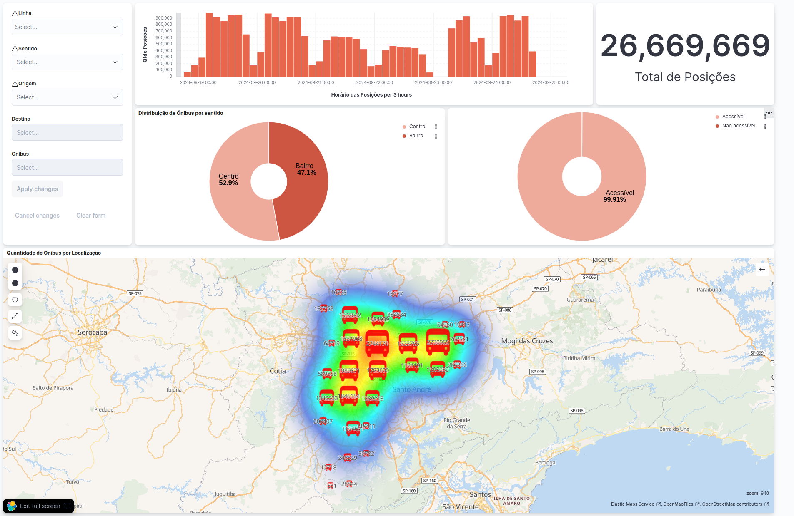

# OtimizaSP

**OtimizaSP** é um sistema projetado para fornecer insights e informações com o objetivo de melhorar o sistema de transporte público na cidade de São Paulo, a maior cidade da América Latina. Ele faz isso aproveitando os dados coletados das posições dos ônibus que circulam pela cidade. Ao processar e analisar esses dados, o OtimizaSP ajuda a otimizar rotas, monitorar o desempenho e melhorar a experiência de transporte dos passageiros.

### Diagrama

O diagrama da arquitetura que representa o fluxo de dados no sistema!
<div align="center">
  
</div>

## Visão Geral do Sistema

A arquitetura do OtimizaSP envolve os seguintes componentes principais:

- **NiFi (RAW e TRUSTED):** O Apache NiFi é utilizado para lidar com a ingestão de dados e o gerenciamento de fluxo. Ele se integra com sistemas externos como o **SPTrans** e a plataforma **Olho Vivo**, que fornecem dados de rastreamento de ônibus em tempo real.
- **S3 (RAW e TRUSTED):** Os buckets do S3 são utilizados para armazenar dados brutos e confiáveis ingeridos de fontes externas.
- **Apache Spark:** É utilizado para o processamento e transformação dos dados de posição dos ônibus armazenados nos buckets do S3 e envio para o ElasticSearch
- **ElasticSearch & Kibana:** Esses componentes são usados para indexar, pesquisar e visualizar dados, ajudando os usuários a analisar tendências, identificar padrões e obter insights acionáveis a partir dos dados.

O sistema integra dados de posição de ônibus em tempo real dos sistemas **SPTrans** e **Olho Vivo** e os armazena em um data lake, onde são processados e disponibilizados para análise por meio de plataformas de visualização como o Kibana.

## Serviços

O arquivo `docker-compose.yml` que está na pasta lab, define diversos serviços essenciais para o pipeline de dados da **OTMZSP**, conectados através da rede personalizada `otmzsp-network`. Abaixo estão os detalhes sobre cada serviço e instruções de acesso.

### 1. **Nifi (Apache NiFi)**

- **Função**: Utilizado para a **ingestão de dados**, automatizando fluxos de dados desde a captura até a entrega.
- **Acesso**:
  - **URL**: [http://localhost:49090](http://localhost:49090)
  - **Porta**: 9090 (mapeada para 49090 no host)
- **Configurações**:
  - Volume montado para persistência de dados e logs.
  - Fuso horário configurado para **America/Sao_Paulo**.

### 2. **MinIO (Data Lake)**

- **Função**: Solução de **armazenamento de objetos**, compatível com S3. Armazena dados brutos em `raw` e dados processados em `trusted`.
- **Acesso**:
  - **Console**: [http://localhost:49001](http://localhost:49001)
  - **Serviço de Armazenamento**: [http://localhost:49000](http://localhost:49000)
  - **Credenciais**:
    - **Usuário**: `admin`
    - **Senha**: `minioadmin`
- **Configurações**:
  - Volumes montados para persistência de dados (`/minio_data/raw` e `/minio_data/trusted`).

### 3. **Spark**

#### **Spark Master**

- **Função**: Componente **Master** do Apache Spark para processamento distribuído de dados.
- **Acesso**:
  - **URL**: [http://localhost:8080](http://localhost:8080) (UI do Spark Master)
  - **Porta**: 7077 (comunicação do Master)
- **Configurações**:
  - Fuso horário configurado para **America/Sao_Paulo**.
  - Volume montado para utilitários (`/util`).

#### **Spark Worker**

- **Função**: Componente **Worker** que executa as tarefas atribuídas pelo Spark Master.
- **Acesso**:
  - **URL**: [http://localhost:8081](http://localhost:8081) (UI do Spark Worker)
- **Configurações**:
  - Conectado ao Spark Master via URL `spark://spark-master-otmzsp:7077`.
  - Volume montado para utilitários (`/util`) e diretório de trabalho (`/home/user`).

### 4. **Jupyter**

- **Função**: Interface do **Jupyter Notebook** para desenvolvimento de notebooks PySpark.
- **Acesso**:
  - **URL**: [http://localhost:8888](http://localhost:8888)
  - **Porta**: 8888 (Jupyter), 4040 a 4043 (Monitoramento de Tarefas Spark)
- **Configurações**:
  - Volume montado para armazenamento de notebooks (`/home/jovyan/work`).
  - Sem token de autenticação para facilitar o uso.

### 5. **Elasticsearch**

- **Função**: Banco de dados para **indexação e busca** de dados estruturados e não estruturados.
- **Acesso**:
  - **URL**: [http://localhost:49200](http://localhost:49200) (API)
- **Configurações**:
  - Ambiente configurado para modo **single-node**.
  - Volume montado para persistência de dados (`/usr/share/elasticsearch/data`).

### 6. **Kibana**

- **Função**: Ferramenta de **visualização de dados** do Elasticsearch.
- **Acesso**:
  - **URL**: [http://localhost:45601](http://localhost:45601)
- **Configurações**:
  - Conectado ao Elasticsearch no endereço `http://elasticsearch-otmzsp:9200`.

## Rede

- **Rede Criada**: `otmzsp-network`
  - **Driver**: bridge
  - Conecta os serviços permitindo comunicação entre eles.

## Comandos

- **Iniciar os serviços**:
  ```bash
  docker-compose up -d
  ```
- **Parar os serviços**:
  ```bash
  docker-compose down
  ```

## Observações

- Verifique se as versões do NiFi, MinIO, Spark, Jupyter, Elasticsearch e Kibana estão configuradas corretamente no arquivo `.env`.
- O NiFi está acessível via HTTP na porta `49090`.
- O MinIO pode ser acessado tanto para o armazenamento quanto para gerenciamento via console.
- Certifique-se de que o serviço Elasticsearch esteja **saudável** antes de iniciar o Kibana.


## Análise de Dados

Foram realizadas diversas análises exploratórias e pré-processamentos com os dados disponibilizados durante o desenvolvimento do projeto. Essas análises incluíram a inspeção dos dados, detecção de padrões, e transformações visando a otimização dos fluxos de dados e a preparação para futuras integrações. No entanto, devido às limitações de tempo, não foi possível implementar todas as melhorias e conclusões dessas análises no pipeline atual.

O detalhamento das análises e as etapas realizadas podem ser conferidos no notebook interativo, disponível [neste link](https://colab.research.google.com/drive/1kZ4u6iMPOMT-crjTAy5H9D9HVyINoKzM?usp=sharing#scrollTo=HC1BtS2ruWCN).

## Dashboard

Abaixo figura que ilustra a aparência do Dashboard
<div align="center">
  
</div>